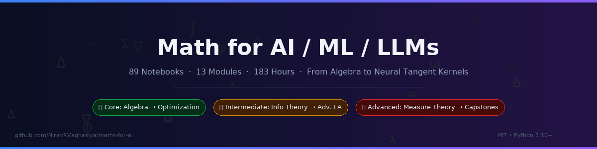
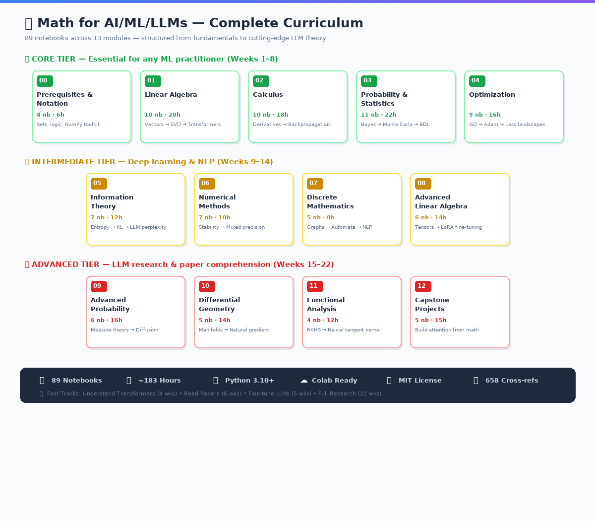
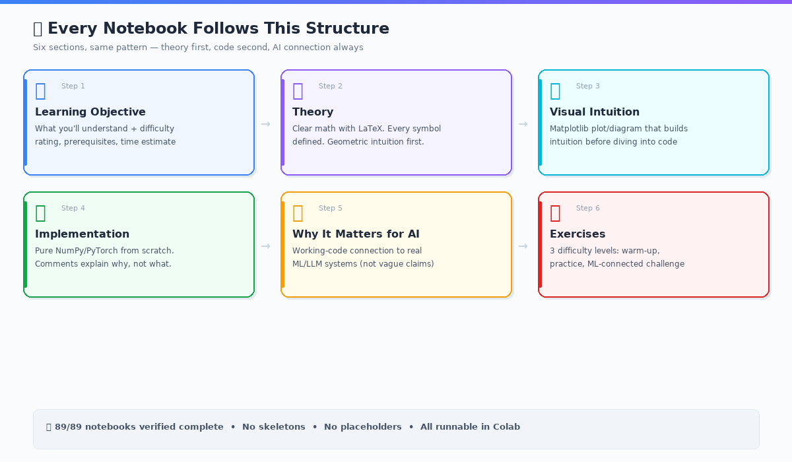
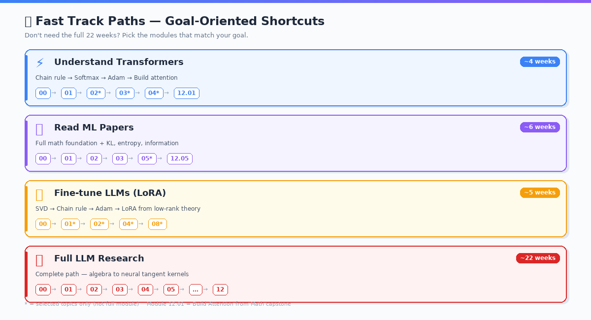

# 🚀 GitHub Repository Presentation Guide

## Repository Settings (github.com → Settings)

### Description

```
Every piece of mathematics you need to understand, build, and research AI/ML/LLM systems — 89 Jupyter notebooks, from algebra to neural tangent kernels.

```

### Website

```
https://colab.research.google.com/github/NiravRVaghasiya/maths-for-ai/blob/main/00_Prerequisites/01_mathematical_notation.ipynb

```

### Topics (add all of these)

```
mathematics  machine-learning  deep-learning  linear-algebra  calculus
probability  optimization  information-theory  transformers  llm
jupyter-notebook  education  tutorial  pytorch  numpy  lora

```

### Social Preview

Upload `_assets/images/social_preview.png` (1280×640) via:**Settings → General → Social preview → Edit → Upload an image**

---

## Image Assets Provided

| File | Size | Purpose |
| --- | --- | --- |
| `_assets/images/social_preview.png` | 1280×640 | GitHub/Twitter/LinkedIn Open Graph card |
| `_assets/images/readme_banner.png` | 1200×300 | Optional README header image |
| `_assets/images/curriculum_overview.png` | 1200×1050 | Visual module map for README or docs |
| `_assets/images/notebook_structure.png` | 1200×700 | Shows the 6-part notebook format |
| `_assets/images/fast_tracks.png` | 1200×650 | Visual fast-track path reference |

---

## Optional: Add Banner to README

Insert this at the very top of `README.md` (before `# 🧮`):

```markdown
<p align="center">
  
</p>

```

---

## Optional: Add Curriculum & Structure images to README

After the "Complete Module List" section:

```markdown
<p align="center">
  
</p>

```

After "How Each Notebook Works" section:

```markdown
<p align="center">
  
</p>

```

After "Fast Track Paths" section:

```markdown
<p align="center">
  
</p>

```

---

## Additional Badges (optional — add below existing badges)

```markdown
[](https://github.com/NiravRVaghasiya/maths-for-ai)
[](https://github.com/NiravRVaghasiya/maths-for-ai/fork)
[](https://github.com/NiravRVaghasiya/maths-for-ai)

```

---

## First Release

```bash
git tag -a v1.0.0 -m "Initial release: 89 complete notebooks across 13 modules"
git push origin v1.0.0

```

This activates GitHub's Releases section and improves discoverability.

---

## CI/CD (post-publish, optional)

Add `.github/workflows/test-notebooks.yml`:

```yaml
name: Test Notebooks
on:
  push:
    branches: [main]
  pull_request:
    branches: [main]

jobs:
  test:
    runs-on: ubuntu-latest
    strategy:
      matrix:
        module: ['00_Prerequisites', '01_Linear_Algebra']  # start small
    steps:
      - uses: actions/checkout@v4
      - uses: actions/setup-python@v5
        with:
          python-version: '3.10'
      - run: pip install -r requirements.txt nbval
      - run: pytest --nbval-lax ${{ matrix.module }}/ --timeout=120

```

---

## Files Summary (nothing existing was modified)

```
_assets/images/
├── learning-path.png          ← EXISTING (untouched)
├── social_preview.png         ← NEW
├── readme_banner.png          ← NEW
├── curriculum_overview.png    ← NEW
├── notebook_structure.png     ← NEW
└── fast_tracks.png            ← NEW

GITHUB_PRESENTATION_GUIDE.md   ← NEW (this file — can live at repo root or _assets/)

```

