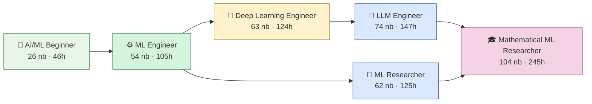
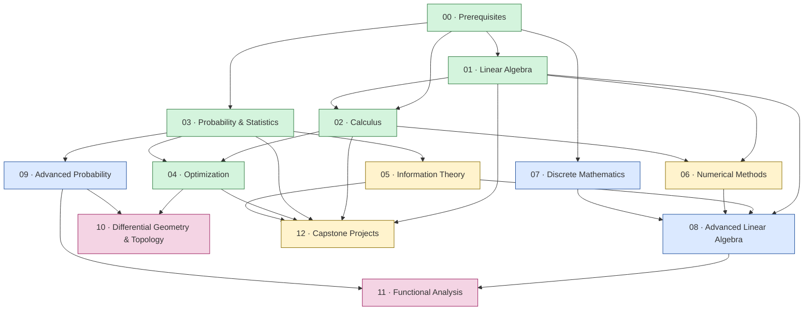

# 🗺️ Learning Path

This document is the curriculum's prerequisite graph: what every module and notebook actually
depends on, what depends on it, which prerequisites are optional/helpful rather than required,
and how to plan a route through the material that fits your goal. Everything below — every
prerequisite, every dependent, every hour estimate — was derived directly from each notebook's
own header metadata and cross-references, then verified as a consistent, acyclic graph (no
notebook prerequisite points forward or to something nonexistent).

**Start with [Learning Tracks](#-learning-tracks-six-ways-through-the-curriculum)** — six
role-oriented, cumulative journeys through the curriculum (no duplicated content; each
track is just a curated, verified subset of the existing curriculum plus a defined order). If
you want the raw dependency data instead, see [Module-Level Graph](#-module-level-graph) and
[Notebook-Level Graph by Module](#-notebook-level-graph-by-module) below. If you have a single
narrow destination in mind rather than a full role, see
[Goal-Oriented Learning Paths](#-goal-oriented-learning-paths) further down.

---

## 🧑‍🎓 Learning Tracks: Six Ways Through the Curriculum

Every track below is a **cumulative, verified subset** of the curriculum — nothing is
duplicated or rewritten per track. Each track's notebook set was computed as the *transitive
closure* of a curated target list against the dependency graph in
[Notebook-Level Graph by Module](#-notebook-level-graph-by-module), so every hard prerequisite
for every notebook in a track is guaranteed to already be in that track. The six tracks nest
into two ladders that both start at **AI/ML Beginner** and both pass through **ML Engineer**:

> An arrow `A → B` means "every notebook in A is also in B, plus more." **LLM Engineer** and
> **ML Researcher** are siblings, not a ladder — they both extend **ML Engineer** in different
> directions (practical fine-tuning vs. theoretical generative-model research) and neither is a
> prerequisite for the other. **Mathematical ML Researcher** is the only track that requires
> *both* siblings' material (plus Modules 10–11, which nothing else needs).

### Which track is for me?

| If your goal is... | Track |
|---|---|
| Understand the math behind ML for the first time — no prior background | 🌱 [AI/ML Beginner](#-track-aiml-beginner) |
| Build, train, and ship models as your day job | ⚙️ [ML Engineer](#-track-ml-engineer) |
| Work on deep learning systems at production scale (numerical stability, mixed precision, GPT-scale models) | 🧠 [Deep Learning Engineer](#-track-deep-learning-engineer) |
| Fine-tune, adapt, and deploy large language models | 🤖 [LLM Engineer](#-track-llm-engineer) |
| Read, evaluate, and contribute to ML research (generative models, learning theory) | 🔬 [ML Researcher](#-track-ml-researcher) |
| Do foundational/theoretical research (information geometry, functional analysis, NTK) | 🎓 [Mathematical ML Researcher](#-track-mathematical-ml-researcher) |

### Track comparison

| Track | Notebooks | Est. Hours | Modules Required | Modules Skipped | Capstone |
|---|---|---|---|---|---|
| 🌱 AI/ML Beginner | 26 | ~46h | 00, 01, **02** (partial), **03** (partial) | 04–12 | *(none — see track notes)* |
| ⚙️ ML Engineer | 54 | ~105h | 00–05, **12** (partial: `12.01`–`12.03`) | 06–11 | `12.03` Implement Adam |
| 🧠 Deep Learning Engineer | 63 | ~124h | 00–06, 12 (all) | 07–11 | `12.05` Read a Paper (`12.04` GPT analysis en route) |
| 🤖 LLM Engineer | 74 | ~147h | 00–08, 12 (all) | 09, 10, 11 | `08.06` LoRA/QLoRA + `12.05` Read a Paper |
| 🔬 ML Researcher | 62 | ~125h | 00–05, 09, 12 (all) | 06, 07, 08, 10, 11 | `09.06` Diffusion + `12.05` Read a Paper |
| 🎓 Mathematical ML Researcher | 104 | ~245h | all 14 | *(none)* | `10.05`/`11.04` (+ `12.05` en route) |

Every hour figure is computed the same way as the rest of this document — from each notebook's
own declared reading time, scaled by this repo's ~1.76× reading-to-total-hours multiplier (see
[README.md](README.md)) — not estimated by module count.

> **Count caveat:** the per-track notebook counts and hours in the table above were computed
> against an earlier 89-notebook version of the curriculum. The repository now has **104
> notebooks across 14 modules** — Module 13 (Statistical Learning Theory, 9 notebooks) and
> notebooks added to Modules 04, 06, and 09. That new material is complete but is not yet folded
> into each track's transitive-closure count; the track *structure and ordering* are unchanged,
> and the figures are being recomputed. See the [module-level table](#-module-level-graph) for
> the verified per-module counts.

> The "Capstone" column above names each track's *taught* capstone notebook (`12.01`–`12.05`,
> with full worked solutions). For a graded, do-it-yourself alternative, the
> [**capstone system**](12_Capstone_Projects/capstones/README.md) turns these into a six-rung,
> increasing-difficulty ladder of project specifications (no answer key) — from linear regression
> up to an open experimental-research capstone.

---

### 🌱 Track: AI/ML Beginner

**Who it's for:** you have high-school algebra and want to understand the actual mathematics
behind ML — not just call `model.fit()` — starting from zero assumed background.

**Starting prerequisites:** none beyond high-school algebra (this is `00.01`'s own stated
prerequisite — the graph's only root). If you already know vectors/matrices/basic calculus from
a STEM background, you can skip ahead — see [Accelerated entry points](#accelerated-entry-points-by-background)
below.

**Required modules:** `00` Prerequisites (all 4) → `01` Linear Algebra (all 10) → `02` Calculus
(`02.01`–`02.05` only) → `03` Probability & Statistics (`03.01`–`03.07` only).

**Optional/enrichment:** none recommended yet — finish this track's own scope before adding
anything else. The natural next step is the ML Engineer track below, which is a strict superset.

**Notebook sequence:**

| Order | Module | Notebooks | Milestone |
|---|---|---|---|
| 1 | `00` Prerequisites | `00.01`–`00.04` | Read/write mathematical notation, basic proof techniques, NumPy fluency |
| 2 | `01` Linear Algebra | `01.01`–`01.10` | Vectors → matrices → eigenvalues → SVD/PCA → transformer Q/K/V, end to end |
| 3 | `02` Calculus (partial) | `02.01`–`02.05` | Limits → derivatives → the chain rule → gradients (stop before Jacobians/Hessians) |
| 4 | `03` Probability & Statistics (partial) | `03.01`–`03.07` | Probability axioms → distributions → Bayes' theorem → maximum likelihood (stop before hypothesis testing) |

**Estimated hours:** ~46 hours (~26 hours reading + exercises/practice).

**Expected competency at the end:**
- *Math:* comfortable reading Σ/Π notation and set-builder notation; can compute a matrix
  product, an eigendecomposition, and an SVD by hand on a small example; can take a partial
  derivative and apply the chain rule; can state and apply Bayes' theorem; understands what
  maximum likelihood estimation is trying to do.
- *AI:* can explain *why* PCA reduces dimensionality, what an embedding vector is, why softmax
  needs to subtract nothing yet (numerical stability is Module 06, not covered here), and how
  Q/K/V attention scores are literally a matrix product — but not yet how a network is
  *trained* (that needs Calculus `02.06`+ and Optimization, Module 04).

**Capstone:** none — this track deliberately stops short of every Module 12 capstone (`12.01`
needs `04.09` and `05.07`, neither of which this track includes). Completing this track means
you're ready to *start* the ML Engineer track's Optimization and Information Theory modules
immediately, with zero repeated material.

**What can safely be skipped:** everything from Module 04 onward. `02.06`–`02.10` (Jacobians,
integration, vector calculus, backprop) and `03.08`–`03.11` (hypothesis testing, sampling,
probabilistic models, Bayesian deep learning) are real, useful notebooks, but nothing in *this*
track's own scope needs them — they're exactly what the ML Engineer track adds next.

---

### ⚙️ Track: ML Engineer

**Who it's for:** you build, train, and evaluate ML models as a practical, hands-on job — you
need to understand backprop, optimizers, and losses well enough to debug them, not just prove
theorems about them.

**Starting prerequisites:** high-school algebra (same as Beginner — this track includes the
entire Beginner track as its first four modules). If you've already completed the Beginner
track, start directly at `02.06`.

**Required modules:** `00`–`03` (all, in full — this is the Beginner track's scope extended to
completion) → `04` Optimization (all 9) → `05` Information Theory (all 7) → `12` Capstone
Projects (`12.01`–`12.03` only).

**Optional/enrichment:** `06` Numerical Methods (if you want to understand *why* training
sometimes silently produces NaN losses) and `07` Discrete Mathematics (if tokenization/NLP
internals interest you) are natural next reads, but neither is required for this track's own
destination — they're exactly what the Deep Learning Engineer and LLM Engineer tracks add.

**Notebook sequence:**

| Order | Module | Notebooks | Milestone |
|---|---|---|---|
| 1–4 | `00`–`03` | *(full Beginner scope, completed)* | Foundational math fluency |
| 5 | `02` Calculus (completed) | `02.06`–`02.10` | Jacobians/Hessians → integration → vector calculus → **backpropagation derived from scratch** |
| 6 | `03` Probability (completed) | `03.08`–`03.11` | Hypothesis testing → Monte Carlo/MCMC → GMMs/Naive Bayes → Bayesian deep learning (MC-Dropout) |
| 7 | `04` Optimization | `04.01`–`04.09` | Loss landscapes → SGD → convexity → **Adam/RMSProp derived** → constraints → LR schedules → second-order methods → training tricks → loss visualization |
| 8 | `05` Information Theory | `05.01`–`05.07` | Entropy → KL divergence → **cross-entropy (the loss function)** → mutual information → info bottleneck → coding theory → LLM perplexity |
| 9 | `12` Capstone (partial) | `12.01` → `12.02` → `12.03` | Build attention from math → derive backprop from scratch → **implement Adam from scratch** |

**Estimated hours:** ~105 hours (~60 hours reading + exercises/practice).

**Expected competency at the end:**
- *Math:* can derive backpropagation through a dense/conv/attention layer by hand; understands
  why Adam uses bias-corrected first/second moment estimates instead of raw gradients;
  understands convexity's role in convergence guarantees; can derive cross-entropy from KL
  divergence and explain why it's the natural loss for classification and language modeling.
- *AI:* can build a working multi-head attention mechanism and a custom optimizer from raw
  NumPy/PyTorch tensor ops with zero framework magic; can read a training loss curve and
  diagnose whether the problem is the learning rate, the loss landscape, or the optimizer;
  understands MC-Dropout as a cheap uncertainty-estimation technique.

**Capstone:** `12.03` — *Implement the Adam Optimizer*, reached by completing `12.01` (attention)
→ `12.02` (backprop) → `12.03` (Adam) in sequence. This is deliberately where the track stops:
`12.04` (GPT-scale parameter/FLOP counting) and `12.05` (reading "Attention Is All You Need"
end to end) are excluded by design, not because anything blocks them — they're the Deep
Learning Engineer track's natural extension.

**What can safely be skipped:** Modules 06 (Numerical Methods), 07 (Discrete Mathematics), 08
(Advanced Linear Algebra), 09 (Advanced Probability), 10 (Differential Geometry & Topology), 11
(Functional Analysis). None of these block anything in this track's own scope; per the
[module-level graph](#module-table) above, Modules 10 and 11 are near-leaf nodes that nothing
else in the *entire* curriculum needs, so deferring them costs nothing even beyond this track.

---

### 🧠 Track: Deep Learning Engineer

**Who it's for:** you work on deep learning systems at a scale where numerical behavior
matters — mixed-precision training, attention-score overflow, memory/FLOP budgeting for large
models — not just getting a small model to converge.

**Starting prerequisites:** same as ML Engineer (this track is a strict superset). If you've
already completed the ML Engineer track, start directly at `06.01`.

**Required modules:** everything in the ML Engineer track, plus `06` Numerical Methods (all 7)
and the rest of Module 12 (`12.04`–`12.05`).

**Optional/enrichment:** `07` Discrete Mathematics and `08` Advanced Linear Algebra (the LLM
Engineer track's additions) are the natural next step if your deep learning work is
specifically NLP/LLM-shaped rather than general (vision, multimodal, RL, etc.).

**Notebook sequence:**

| Order | Module | Notebooks | Milestone |
|---|---|---|---|
| 1–8 | `00`–`05` | *(full ML Engineer scope, completed)* | Backprop, Adam, cross-entropy all derived from scratch |
| 9 | `06` Numerical Methods | `06.01`–`06.07` | IEEE 754 float formats → catastrophic cancellation/log-sum-exp → numerical differentiation & gradient checking → conjugate gradient/preconditioning → interpolation → **mixed-precision training** → **transformer-specific overflow/pre-vs-post-norm** |
| 10 | `12` Capstone (completed) | `12.04` → `12.05` | **GPT parameter/FLOP/memory counting against published scaling laws** → read "Attention Is All You Need" equation by equation |

**Estimated hours:** ~124 hours (~71 hours reading + exercises/practice).

**Expected competency at the end:**
- *Math:* understands machine epsilon and why bfloat16 trades mantissa precision for exponent
  range; can derive the log-sum-exp trick and explain exactly why naive softmax overflows;
  knows when conjugate gradient's O(n) guarantee actually matters at scale; can compute a
  transformer's parameter count and FLOPs per forward pass from its architecture hyperparameters
  alone.
- *AI:* can diagnose a NaN loss as an overflow vs. an underflow vs. a genuine divergence; knows
  why modern LLM pretraining uses bfloat16 rather than float16; can reason about pre-norm vs.
  post-norm placement's effect on gradient flow in deep transformer stacks; can estimate whether
  a target model size is feasible on given hardware before writing any training code.

**Capstone:** `12.05` — *Read a Research Paper Mathematically*, decoding "Attention Is All You
Need" equation by equation using everything in the track. `12.04` (GPT-scale mathematical
analysis — the notebook most specific to this track's own theme of scale and numerics) is
completed immediately beforehand and is worth calling out as this track's signature milestone
in its own right.

**What can safely be skipped:** Modules 07 (Discrete Mathematics), 08 (Advanced Linear Algebra),
09 (Advanced Probability), 10, 11. If your deep learning work never touches fine-tuning
specifically, Module 08 (which culminates in LoRA) is genuinely optional — it's what turns this
track into the LLM Engineer track below.

---

### 🤖 Track: LLM Engineer

**Who it's for:** you fine-tune, adapt, and deploy large language models — LoRA/QLoRA,
tokenization internals, and transformer-specific numerical issues are your daily concerns.

**Starting prerequisites:** same as Deep Learning Engineer (this track is a strict superset). If
you've already completed that track, start directly at `07.01`.

**Required modules:** everything in the Deep Learning Engineer track, plus `07` Discrete
Mathematics (all 5) and `08` Advanced Linear Algebra (all 6).

**Optional/enrichment:** `09` Advanced Probability, specifically `09.05`–`09.06` (generative
model theory, diffusion), is increasingly relevant as LLM engineering work extends into
multimodal/diffusion territory — but it is not required for this track's own destination.

**Notebook sequence:**

| Order | Module | Notebooks | Milestone |
|---|---|---|---|
| 1–9 | `00`–`06`, `12.04`–`12.05` | *(full Deep Learning Engineer scope, completed)* | Numerically-safe training at scale |
| 10 | `07` Discrete Mathematics | `07.01`–`07.05` | Combinatorics → graph theory/Laplacians → trees/tries/beam search → **automata, regex, and the Chomsky hierarchy (tokenization/grammars)** → edit distance, BLEU, and RLHF preference ranking |
| 11 | `08` Advanced Linear Algebra | `08.01`–`08.06` | Inner product spaces → matrix calculus (dense-layer gradients) → tensor decompositions → random matrix theory (init schemes) → Eckart-Young/low-rank approximation → **LoRA and QLoRA derived from first principles** |

**Estimated hours:** ~147 hours (~84 hours reading + exercises/practice).

**Expected competency at the end:**
- *Math:* can derive the LoRA update $W = W_0 + BA$ from the Eckart–Young theorem and explain
  why zero-initializing $B$ guarantees the adapted model starts identical to the base model; can
  place a tokenizer's grammar on the Chomsky hierarchy; understands the Nyström method and
  randomized SVD as the scaling tricks behind low-rank approximation at LLM scale.
- *AI:* can reason about LoRA rank choice as a parameter-count/expressiveness tradeoff; can
  explain and implement QLoRA's 4-bit-frozen-weights-plus-full-precision-adapter scheme; can
  connect edit distance and BLEU to how generated text is actually evaluated; understands RLHF's
  preference ranking as a partial order, not a total order, over model outputs.

**Capstone:** the track's signature deliverable is `08.06` — *LoRA and Efficient Fine-Tuning* —
which is where the whole Advanced Linear Algebra module has been building. The formal Module 12
capstone is still `12.05` (already completed as part of the Deep Learning Engineer scope this
track extends), so finishing `08.06` is this track's true terminal milestone.

**What can safely be skipped:** Modules 09 (Advanced Probability), 10 (Differential Geometry &
Topology), 11 (Functional Analysis) — the ML Researcher / Mathematical ML Researcher tracks'
territory. None of these block LoRA, QLoRA, tokenization, or transformer numerics.

---

### 🔬 Track: ML Researcher

**Who it's for:** you read, evaluate, and produce ML research — particularly generative models
(VAEs, GANs, diffusion) and learning theory — and need the probabilistic/measure-theoretic
apparatus that papers in this area assume.

**Starting prerequisites:** same as ML Engineer (this track is a sibling of Deep Learning
Engineer and LLM Engineer, not a further extension of them — it branches off ML Engineer in a
different direction). If you've already completed the ML Engineer track, start directly at
`09.01`.

**Required modules:** everything in the ML Engineer track, plus `09` Advanced Probability (all
6) and the rest of Module 12 (`12.04`–`12.05`).

**Optional/enrichment:** `06` Numerical Methods if your research involves training large models
directly rather than only theorizing about them; `10` Differential Geometry & Topology
specifically if your research is about optimization geometry (natural gradient, information
geometry) rather than generative models — that's the Mathematical ML Researcher track's
territory.

**Notebook sequence:**

| Order | Module | Notebooks | Milestone |
|---|---|---|---|
| 1–8 | `00`–`05` | *(full ML Engineer scope minus the capstones, completed)* | Backprop, Adam, cross-entropy all derived from scratch |
| 9 | `09` Advanced Probability | `09.01`–`09.06` | Measure theory & Lebesgue integration → Brownian motion/Itô calculus → Markov chains & mixing times → Hoeffding/Bernstein/PAC-Bayes concentration bounds → **VAE ELBO & GAN minimax theory** → **DDPM/DDIM diffusion derived from first principles** |
| 10 | `12` Capstone (completed) | `12.01`→`12.02`→`12.03`→`12.04`→`12.05` | Full capstone arc, ending on paper-reading |

**Estimated hours:** ~125 hours (~71 hours reading + exercises/practice).

**Expected competency at the end:**
- *Math:* comfortable with σ-algebras and the Lebesgue integral as the measure-theoretic
  foundation modern ML theory papers assume; can derive a Markov chain's mixing time from its
  second-largest eigenvalue; can state and apply Hoeffding/Bernstein bounds and connect them to
  PAC-Bayes generalization guarantees; can derive the VAE's ELBO and the forward/reverse
  diffusion process's closed-form marginals by induction.
- *AI:* can read a generative-modeling paper's theory section without treating the measure-theoretic
  notation as a black box; understands *why* GAN training is a minimax game and what optimal
  discriminator theory predicts; can explain denoising score matching's role in DDPM/DDIM.

**Capstone:** `12.05` — *Read a Research Paper Mathematically* — paired with `09.06` (*The Math
of Diffusion Processes*) as this track's signature specialization piece, the same way `08.06`
(LoRA) anchors the LLM Engineer track.

**What can safely be skipped:** Modules 06 (Numerical Methods), 07 (Discrete Mathematics), 08
(Advanced Linear Algebra), 10, 11. If your research specifically concerns optimization geometry
or infinite-width network theory rather than generative models, swap this track's Module 09 focus
for Modules 10–11 instead — see the Mathematical ML Researcher track, which includes both.

---

### 🎓 Track: Mathematical ML Researcher

**Who it's for:** you do foundational or theoretical ML research — information geometry,
natural gradient methods, Lie groups/equivariance, topological data analysis, kernel methods,
or infinite-width network theory — and want the full graduate-level mathematical apparatus, not
just the ML-adjacent parts of it.

**Starting prerequisites:** same as every other track (high-school algebra via `00.01`) — this
track is simply the complete curriculum, so there is no meaningfully smaller starting point
within this repository. If you already hold a graduate degree in a relevant pure-math area
(measure theory, differential geometry, or functional analysis specifically), you can likely
skip straight to whichever of Modules 09/10/11 is *not* your specialty and treat the others as
review — see [Accelerated entry points](#accelerated-entry-points-by-background) below.

**Required modules:** Modules 00–12 as originally defined — this track is the union of the LLM
Engineer and ML Researcher tracks, plus Modules 10 (Differential Geometry & Topology) and 11
(Functional Analysis), which nothing else in the curriculum requires. (Module 13, Statistical
Learning Theory, is newer content not yet folded into this track's closure — see the note under
the [track table](#-learning-tracks-six-ways-through-the-curriculum).)

**Optional/enrichment:** none — there is nothing left to add. The only real choice left is
*ordering*: Modules 10 and 11 do not depend on each other, so you can do either first. See
[Full Curriculum: Two Equally Valid Orderings](#-full-curriculum-two-equally-valid-orderings)
below for both valid sequences.

**Notebook sequence:**

| Order | Module | Notebooks | Milestone |
|---|---|---|---|
| 1–11 | `00`–`09` | *(full LLM Engineer ∪ ML Researcher scope, completed)* | Every Core/Important/Specialized module finished |
| 12 | `10` Differential Geometry & Topology | `10.01`–`10.05` | Manifolds/curvature → **information geometry (Fisher metric)** → **natural gradient descent & K-FAC** → Lie groups/equivariance → persistent homology |
| 13 | `11` Functional Analysis | `11.01`–`11.04` | Banach/Hilbert spaces → **kernel methods & the representer theorem** → **the Neural Tangent Kernel** → infinite-width mean-field theory & edge-of-chaos |
| 14 | `12` Capstone (already completed as part of the tracks above) | `12.01`–`12.05` | — |

*(Order 12 and 13 are interchangeable — see the two valid full-curriculum orderings referenced
above.)*

**Estimated hours:** ~183 hours (~104 hours reading + exercises/practice) — the entire
curriculum.

**Expected competency at the end:**
- *Math:* the complete stated scope of this repository: everything from high-school algebra
  through Riemannian manifolds, the Fisher information metric as a statistical-manifold metric,
  Lie groups and equivariance, persistent homology, Banach/Hilbert spaces, reproducing kernel
  Hilbert spaces, and the Neural Tangent Kernel's lazy-training regime.
- *AI:* can derive natural gradient descent from the Fisher information metric and explain
  K-FAC as a scalable block-diagonal approximation to it; can connect kernel methods' representer
  theorem to Gaussian processes; can explain infinite-width networks' mean-field behavior and
  the edge-of-chaos regime that governs signal propagation at initialization.

**Capstone:** every Module 12 capstone (`12.01`–`12.05`) is completed earlier in this track as
part of the LLM Engineer/ML Researcher scope it extends. This track's own two terminal
milestones are `10.05` (*Topological Data Analysis*) and `11.04` (*Infinite-Width Networks*) —
both are true leaves in the dependency graph (nothing anywhere in the curriculum depends on
either), making them the genuine frontier of this repository's content. `10.03` (*Natural
Gradient Methods*) is worth calling out separately as the track's most AI-relevant milestone
within Module 10, even though `10.04`–`10.05` still follow it.

**What can safely be skipped:** nothing — this track is the entire curriculum by construction.

---

### Accelerated entry points by background

Every track above formally starts at `00.01`, since that's this curriculum's own stated
baseline (high-school algebra only). If you already have relevant background, you can validly
skip ahead — the dependency graph doesn't care *how* you satisfy a prerequisite, only that you
do:

| Your background | Skip to | Applies to |
|---|---|---|
| Comfortable with vectors, matrices, and basic Python, but no formal linear algebra course | `01.01` | Any track |
| Completed university linear algebra and single/multivariable calculus | `03.01` | Any track |
| Existing applied ML experience (already know gradient descent, cross-entropy, backprop) | `06.01` (Deep Learning Engineer / LLM Engineer) or `09.01` (ML Researcher) | DL Engineer, LLM Engineer, ML Researcher, Math ML Researcher |
| Graduate degree in measure-theoretic probability | `09.02` | ML Researcher, Math ML Researcher |
| Graduate degree in differential geometry | `10.02` | Math ML Researcher |
| Graduate degree in functional analysis | `11.02` | Math ML Researcher |

Always re-read the target notebook's own header `Prerequisites` field before skipping — the
[Notebook-Level Graph by Module](#-notebook-level-graph-by-module) tables below list every
notebook's exact requirements if you're not sure your background covers them.

---

## 📊 Module-Level Graph

### Dependency diagram

> Colors show each module's [classification](#-classification-legend): 🟢 CORE, 🟡 IMPORTANT,
> 🔵 SPECIALIZED, 🔴 ADVANCED. An arrow `A → B` means "B's notebooks cite at least one A
> notebook as a hard prerequisite" — it does **not** mean every notebook in B needs every
> notebook in A; see the [notebook-level tables](#-notebook-level-graph-by-module) for exactly
> which ones.

### Module table

| # | Module | Classification | Hard Prerequisite Modules | Optional/Helpful From | Notebooks | Est. Hours | Directly Enables |
|---|---|---|---|---|---|---|---|
| 00 | [Prerequisites](00_Prerequisites/) | 🟢 CORE | — (root) | — | 4 | 6 | 01, 02, 03, 07 |
| 01 | [Linear Algebra](01_Linear_Algebra/) | 🟢 CORE | 00 | — | 10 | 20 | 02, 06, 08, 12 |
| 02 | [Calculus](02_Calculus/) | 🟢 CORE | 00, 01 | — | 10 | 18 | 04, 06, 12 |
| 03 | [Probability & Statistics](03_Probability_and_Statistics/) | 🟢 CORE | 00 | 02 (a few notebooks) | 11 | 22 | 04, 05, 09, 12 |
| 04 | [Optimization](04_Optimization/) | 🟢 CORE | 02, 03 | — | 12 | ~20 | 10, 12, 13 |
| 05 | [Information Theory](05_Information_Theory/) | 🟡 IMPORTANT | 03 | — | 7 | 12 | 08, 12 |
| 06 | [Numerical Methods](06_Numerical_Methods/) | 🟡 IMPORTANT | 01, 02 | 04, 05 (a few notebooks) | 8 | ~12 | 08 |
| 07 | [Discrete Mathematics](07_Discrete_Mathematics/) | 🔵 SPECIALIZED | 00 | 01, 06 (one notebook) | 5 | 8 | 08 |
| 08 | [Advanced Linear Algebra](08_Advanced_Linear_Algebra/) | 🔵 SPECIALIZED | 01, 05, 06, 07 | — | 6 | 14 | 11 |
| 09 | [Advanced Probability](09_Advanced_Probability/) | 🔵 SPECIALIZED | 03 | 01, 02, 04, 05, 07 (a few notebooks) | 8 | ~20 | 10, 11 |
| 10 | [Differential Geometry & Topology](10_Differential_Geometry_and_Topology/) | 🔴 ADVANCED | 04, 09 | 05, 08 | 5 | 14 | — (leaf) |
| 11 | [Functional Analysis](11_Functional_Analysis/) | 🔴 ADVANCED | 08, 09 | — | 4 | 12 | — (leaf) |
| 12 | [Capstone Projects](12_Capstone_Projects/) | 🟡 IMPORTANT | 01, 02, 03, 04, 05 | 06 (one notebook) | 5 | 15 | — (leaf) |
| 13 | [Statistical Learning Theory](13_Statistical_Learning_Theory/) | 🔵 SPECIALIZED | 03, 04 | 01, 05, 08, 09, 11 (a few notebooks) | 9 | ~18 | — (leaf) |

**Total: 104 notebooks across 14 modules** (reading + exercises). Notebook counts are verified
against the repository; hour figures marked `~` are approximate. Module 13 and the notebooks
added to Modules 04, 06, and 09 are complete but not yet reflected in the per-track
transitive-closure counts in the [Learning Tracks](#-learning-tracks-six-ways-through-the-curriculum)
tables above — those figures predate this material and are being recomputed.

### DAG layers (longest path from the root)

If you want to know the *earliest possible* point you could start a module — the most
parallelism the dependency graph actually allows — here's the topological layering:

| Layer | Modules that unlock at this layer |
|---|---|
| 0 | 00 Prerequisites |
| 1 | 01 Linear Algebra, 03 Probability & Statistics, 07 Discrete Mathematics |
| 2 | 02 Calculus, 05 Information Theory, 09 Advanced Probability |
| 3 | 04 Optimization, 06 Numerical Methods |
| 4 | 08 Advanced Linear Algebra, 10 Differential Geometry & Topology, 12 Capstone Projects |
| 5 | 11 Functional Analysis |

Reading a layer top to bottom is not required — modules in the *same* layer have no dependency
relationship between them and can be studied in any order, or interleaved. Modules in a *later*
layer always need at least one module from an earlier layer.

### Classification legend

| Tag | Meaning |
|---|---|
| 🟢 **CORE** | Needed by essentially every AI/ML practitioner. High fan-out (dozens of other notebooks build on these). Skipping these blocks most of the rest of the curriculum. |
| 🟡 **IMPORTANT** | Needed for common practical work — training at scale, evaluation, fine-tuning, working end-to-end capstones — but not required to read a first paper or build a first model. |
| 🔵 **SPECIALIZED** | High-value for a specific role or research direction (tensor methods, generative-model theory, NLP-adjacent discrete math) but not universal — most practitioners will use one or two of these modules, not all of them. |
| 🔴 **ADVANCED** | Graduate/research-level mathematical maturity (differential geometry, functional analysis). Near-leaf in the dependency graph — almost nothing downstream needs these, so they're safe to defer indefinitely if your goals don't require them. |

Classification is assigned per-module by default and overridden per-notebook where a specific
notebook's role clearly differs from its module's default (e.g. `05.01`–`05.03`, entropy/KL/
cross-entropy, are CORE even though the rest of Module 05 is IMPORTANT, because cross-entropy
loss itself is close to universal; `08.06` LoRA is IMPORTANT rather than SPECIALIZED because of
how widely it's used in current practice; `09.01` Measure Theory is ADVANCED rather than
SPECIALIZED because its mathematical maturity is a tier above the rest of Module 09). See the
per-notebook tables below for every override.

---

## 🧭 Notebook-Level Graph by Module

Each table below lists, per notebook: its **direct** prerequisites (the smallest set of earlier
notebooks it actually needs — not the full transitive closure, which would be redundant to
list), any **optional/helpful** notebooks that are cited in the notebook's own text but aren't
strictly required, its **direct dependents** (notebooks that list this one as a prerequisite),
its **rigor classification** (replacing the old free-text "maturity" column), whether **proofs**
are load-bearing, whether **implementation** is essential or merely illustrative, its **AI
relevance**, and the **AI knowledge** a learner should already have before starting.

**Rigor categories** (full definitions, calibration guidance, and the old-Maturity correspondence
table are in [`docs/RIGOR_FRAMEWORK.md`](docs/RIGOR_FRAMEWORK.md) — this is a summary):

| Rigor | Meaning |
|---|---|
| 🌱 **INTUITION** | Pure conceptual/geometric understanding — no derivation, no proof. |
| 🔢 **COMPUTATIONAL** | Mechanical procedures on concrete examples, by hand or by code. |
| 🎓 **UNDERGRADUATE** | Standard definitions and worked derivations; proofs, if any, are procedural. |
| 📐 **PROOF-BASED** | A genuine proof (induction, epsilon-delta, a convergence/optimality guarantee, a named theorem) is the load-bearing content. |
| 🏛️ **GRADUATE** | Graduate-level abstraction (measure theory, functional analysis, general/abstract objects). |
| 🔬 **RESEARCH** | Frontier material tied to a specific, named, currently-active paper or technique. |

**Proofs**: None (no formal proof) / Light (a short, ≤5–10 line procedural derivation) / Central
(a genuine, non-trivial proof is the main content). **Implementation**: Illustrative (code
demonstrates a point already made in Theory) / Essential (you can't get the point without
engaging the code — the default for nearly every notebook here).

**AI relevance categories:**
- **Direct** — this notebook's mathematics *is* a specific, named, widely-deployed AI/ML technique (e.g. Adam, LoRA, attention).
- **Foundational** — underlies many techniques without itself being one (e.g. eigenvalues, the chain rule).
- **Theoretical** — explains *why* techniques work or gives research-level understanding (e.g. NTK, information bottleneck).
- **Domain** — most relevant to one AI subfield rather than ML broadly (e.g. formal languages → tokenization/grammar-constrained decoding).

**AI knowledge categories** (what background a learner should have *before* starting, distinct
from what the notebook's own "Why This Matters for AI" section teaches): **None** (pure math,
AI connection introduced from scratch) / **Basic ML** (loss functions, gradient descent,
train/test splits) / **Deep Learning** (backprop, layers, attention/transformers) /
**Research-level** (a specific named technique or paper, e.g. LoRA, diffusion, the NTK).

### 00 · Prerequisites — 🟢 CORE

| Code | Notebook | Prerequisites | Optional | Dependents | Rigor | Proofs | Impl. | AI Relevance | AI Knowledge |
|---|---|---|---|---|---|---|---|---|---|
| `00.01` | [Mathematical Notation](00_Prerequisites/01_mathematical_notation.ipynb) | — | — | `00.02` | INTUITION | None | Illustrative | Foundational | None |
| `00.02` | [Sets, Logic, and Proofs](00_Prerequisites/02_sets_logic_proofs.ipynb) | `00.01` | — | `00.03` | INTUITION | Light | Illustrative | Foundational | None |
| `00.03` | [Functions and Mappings](00_Prerequisites/03_functions_and_mappings.ipynb) | `00.02` | — | `00.04` | INTUITION | None | Illustrative | Foundational | None |
| `00.04` | [The NumPy + SymPy Toolkit](00_Prerequisites/04_numpy_sympy_toolkit.ipynb) | `00.03` | — | `01.01`, `03.01`, `07.01` | COMPUTATIONAL | None | Essential | Foundational | None |

*No prior math needed beyond high-school algebra. This module is the graph's only root.*

### 01 · Linear Algebra — 🟢 CORE

| Code | Notebook | Prerequisites | Optional | Dependents | Rigor | Proofs | Impl. | AI Relevance | AI Knowledge |
|---|---|---|---|---|---|---|---|---|---|
| `01.01` | [Vectors and Vector Spaces](01_Linear_Algebra/01_vectors_and_spaces.ipynb) | `00.04` | — | `01.02` | COMPUTATIONAL | None | Essential | Foundational | None |
| `01.02` | [Matrix Operations](01_Linear_Algebra/02_matrix_operations.ipynb) | `01.01` | — | `01.03`, `01.06`, `01.09` | COMPUTATIONAL | Light | Essential | Foundational | None |
| `01.03` | [Linear Transformations](01_Linear_Algebra/03_linear_transformations.ipynb) | `01.02` | — | `01.04` | COMPUTATIONAL | None | Essential | Foundational | None |
| `01.04` | [Systems of Linear Equations](01_Linear_Algebra/04_systems_of_equations.ipynb) | `01.03` | — | `01.05`, `01.08` | UNDERGRADUATE | Light | Essential | Foundational | None |
| `01.05` | [Determinants and Inverses](01_Linear_Algebra/05_determinants_and_inverses.ipynb) | `01.04` | — | `01.06` | COMPUTATIONAL | None | Essential | Foundational | None |
| `01.06` | [Eigenvalues and Eigenvectors](01_Linear_Algebra/06_eigenvalues_eigenvectors.ipynb) | `01.02`, `01.05` | — | `01.07` | UNDERGRADUATE | Light | Essential | Foundational | None |
| `01.07` | [SVD and PCA](01_Linear_Algebra/07_SVD_and_PCA.ipynb) | `01.06` | — | `01.08` | UNDERGRADUATE | Light | Essential | **Direct** (PCA, low-rank compression) | Basic ML |
| `01.08` | [Matrix Decompositions](01_Linear_Algebra/08_matrix_decompositions.ipynb) | `01.04`, `01.07` | — | `01.10` | COMPUTATIONAL | None | Essential | Foundational | None |
| `01.09` | [Tensor Operations](01_Linear_Algebra/09_tensor_operations.ipynb) | `01.02` | `01.07` | `01.10` | COMPUTATIONAL | None | Essential | **Direct** (einsum, batched ops) | Basic ML |
| `01.10` | [Linear Algebra in Transformers](01_Linear_Algebra/10_linear_algebra_in_transformers.ipynb) | `01.08`, `01.09` | — | `02.01` | UNDERGRADUATE | Light | Essential | **Direct** (Q/K/V, attention) | Deep Learning |

*Notebooks within this module are a strict, linear chain (each depends only on the one
immediately before it, apart from `01.06` also needing `01.02`). `01.09` (tensors) can be read
right after `01.02` if you want to reach transformer notation faster — `01.07` is listed as
optional/helpful there, not required.*

### 02 · Calculus — 🟢 CORE

| Code | Notebook | Prerequisites | Optional | Dependents | Rigor | Proofs | Impl. | AI Relevance | AI Knowledge |
|---|---|---|---|---|---|---|---|---|---|
| `02.01` | [Limits and Continuity](02_Calculus/01_limits_and_continuity.ipynb) | `01.10` | — | `02.02` | PROOF-BASED | Central | Essential | Foundational | None |
| `02.02` | [Derivatives and Differentiation Rules](02_Calculus/02_derivatives_and_rules.ipynb) | `02.01` | — | `02.03` | UNDERGRADUATE | Light | Essential | Foundational | None |
| `02.03` | [Partial Derivatives](02_Calculus/03_partial_derivatives.ipynb) | `02.02` | — | `02.04` | UNDERGRADUATE | Light | Essential | Foundational | None |
| `02.04` | [Chain Rule and Computation Graphs](02_Calculus/04_chain_rule_and_computation_graphs.ipynb) | `02.03` | — | `02.05` | UNDERGRADUATE | Light | Essential | **Direct** (autodiff) | Basic ML |
| `02.05` | [Gradients and Directional Derivatives](02_Calculus/05_gradients_and_directional_derivatives.ipynb) | `02.04` | — | `02.06` | PROOF-BASED | Light | Essential | Foundational | None |
| `02.06` | [Jacobians and Hessians](02_Calculus/06_jacobians_and_hessians.ipynb) | `02.05` | — | `02.07` | UNDERGRADUATE | Light | Essential | Foundational | Basic ML |
| `02.07` | [Integration Fundamentals](02_Calculus/07_integration_fundamentals.ipynb) | `02.06` | — | `02.08` | UNDERGRADUATE | Light | Essential | Foundational | None |
| `02.08` | [Multivariable Calculus](02_Calculus/08_multivariable_calculus.ipynb) | `02.07` | — | `02.09` | UNDERGRADUATE | Light | Essential | Foundational | None |
| `02.09` | [Vector Calculus](02_Calculus/09_vector_calculus.ipynb) | `02.08` | — | `02.10` | PROOF-BASED | Light | Essential | Foundational | None |
| `02.10` | [The Calculus of Backpropagation](02_Calculus/10_calculus_of_backpropagation.ipynb) | `02.09` | — | `04.01` | UNDERGRADUATE | Light | Essential | **Direct** (backprop) | Deep Learning |

*A strict linear chain start to finish. `02.04` (chain rule) is the single most load-bearing
notebook here for AI purposes — if your goal is specifically "understand autodiff," you need
`02.01`–`02.04` at minimum, though continuing to `02.10` is what actually derives backprop.*

### 03 · Probability & Statistics — 🟢 CORE

| Code | Notebook | Prerequisites | Optional | Dependents | Rigor | Proofs | Impl. | AI Relevance | AI Knowledge |
|---|---|---|---|---|---|---|---|---|---|
| `03.01` | [Probability Fundamentals](03_Probability_and_Statistics/01_probability_fundamentals.ipynb) | `00.04` | — | `03.02` | PROOF-BASED | Light | Essential | Foundational | None |
| `03.02` | [Random Variables and Distributions](03_Probability_and_Statistics/02_random_variables_distributions.ipynb) | `03.01` | `02.07` | `03.03` | UNDERGRADUATE | Light | Essential | Foundational | None |
| `03.03` | [Expectation, Variance, and Moments](03_Probability_and_Statistics/03_expectation_variance_moments.ipynb) | `03.02` | `02.02` | `03.04` | UNDERGRADUATE | Light | Essential | Foundational | None |
| `03.04` | [Joint, Conditional, and Marginal Distributions](03_Probability_and_Statistics/04_joint_conditional_marginal.ipynb) | `03.03` | `02.08` | `03.05` | UNDERGRADUATE | Light | Essential | Foundational | None |
| `03.05` | [Bayes' Theorem and Inference](03_Probability_and_Statistics/05_bayes_theorem_and_inference.ipynb) | `03.04` | — | `03.06` | UNDERGRADUATE | Light | Essential | **Direct** (MAP estimation) | Basic ML |
| `03.06` | [A Gallery of Common Distributions](03_Probability_and_Statistics/06_common_distributions_gallery.ipynb) | `03.05` | — | `03.07` | COMPUTATIONAL | None | Essential | Foundational | None |
| `03.07` | [Maximum Likelihood Estimation](03_Probability_and_Statistics/07_maximum_likelihood_estimation.ipynb) | `03.06` | `02.05` | `03.08` | UNDERGRADUATE | Light | Essential | **Direct** (loss = NLL) | Basic ML |
| `03.08` | [Hypothesis Testing and Confidence Intervals](03_Probability_and_Statistics/08_hypothesis_testing_confidence.ipynb) | `03.07` | — | `03.09` | UNDERGRADUATE | Light | Essential | Foundational | None |
| `03.09` | [Sampling and Monte Carlo Methods](03_Probability_and_Statistics/09_sampling_and_monte_carlo.ipynb) | `03.08` | — | `03.10` | UNDERGRADUATE | Light | Essential | **Direct** (MCMC, sampling) | Basic ML |
| `03.10` | [Probabilistic Models in Machine Learning](03_Probability_and_Statistics/10_probabilistic_models_in_ml.ipynb) | `03.09` | — | `03.11` | UNDERGRADUATE | Light | Essential | **Direct** (GMM, Naive Bayes) | Basic ML |
| `03.11` | [Bayesian Deep Learning](03_Probability_and_Statistics/11_bayesian_deep_learning.ipynb) | `03.10` | — | `04.01`, `05.01`, `09.01` | UNDERGRADUATE | Light | Essential | **Direct** (MC-Dropout, uncertainty) | Deep Learning |

*A strict linear chain. This module is the single busiest hub after Module 00/01/02 — it feeds
Optimization, Information Theory, and Advanced Probability directly (see the module diagram),
so a gap here quietly blocks three later modules at once.*

### 04 · Optimization — 🟢 CORE

| Code | Notebook | Prerequisites | Optional | Dependents | Rigor | Proofs | Impl. | AI Relevance | AI Knowledge |
|---|---|---|---|---|---|---|---|---|---|
| `04.01` | [The Optimization Landscape](04_Optimization/01_optimization_landscape.ipynb) | `02.10`, `03.11` | — | `04.02` | PROOF-BASED | Central | Essential | Foundational | Deep Learning |
| `04.02` | [Gradient Descent and Its Variants](04_Optimization/02_gradient_descent_variants.ipynb) | `04.01` | — | `04.03` | UNDERGRADUATE | Light | Essential | **Direct** (SGD) | Basic ML |
| `04.03` | [Convexity and Convergence Guarantees](04_Optimization/03_convexity_and_convergence.ipynb) | `04.02` | — | `04.04` | PROOF-BASED | Central | Essential | Theoretical | Basic ML |
| `04.04` | [Momentum and Adaptive Methods](04_Optimization/04_momentum_and_adaptive_methods.ipynb) | `04.03` | — | `04.05` | UNDERGRADUATE | Light | Essential | **Direct** (Adam, RMSProp) | Basic ML |
| `04.05` | [Constrained Optimization](04_Optimization/05_constrained_optimization.ipynb) | `04.04` | — | `04.06` | PROOF-BASED | Central | Essential | Foundational | Basic ML |
| `04.06` | [Learning Rate Schedules](04_Optimization/06_learning_rate_schedules.ipynb) | `04.05` | — | `04.07` | UNDERGRADUATE | Light | Essential | **Direct** (warmup, cosine decay) | Deep Learning |
| `04.07` | [Second-Order Optimization Methods](04_Optimization/07_second_order_methods.ipynb) | `04.06` | — | `04.08` | PROOF-BASED | Light | Essential | Theoretical | Basic ML |
| `04.08` | [Optimization Tricks in Deep Learning](04_Optimization/08_optimization_in_deep_learning.ipynb) | `04.07` | — | `04.09` | UNDERGRADUATE | Light | Essential | **Direct** (grad clipping, AMP) | Deep Learning |
| `04.09` | [Visualizing Loss Landscapes](04_Optimization/09_loss_landscape_visualization.ipynb) | `04.08` | — | `10.01`, `12.01` | UNDERGRADUATE | Light | Essential | Theoretical *(SPECIALIZED override — see note)* | Deep Learning |

*A strict linear chain, drawing on both Calculus (`02.10`) and Probability (`03.11`) at the
entry point `04.01`. `04.09` is marked SPECIALIZED rather than CORE despite being in this
module — it's a research-diagnostic technique (filter-normalized loss surface plots), not
something most practitioners write themselves, even though everyone benefits from `04.01`–`04.08`.*

### 05 · Information Theory — 🟡 IMPORTANT (with CORE notebooks inside)

| Code | Notebook | Prerequisites | Optional | Dependents | Rigor | Proofs | Impl. | AI Relevance | AI Knowledge |
|---|---|---|---|---|---|---|---|---|---|
| `05.01` | [Entropy and Information](05_Information_Theory/01_entropy_and_information.ipynb) | `03.11` | — | `05.02` | PROOF-BASED | Light | Essential | Foundational *(CORE override)* | None |
| `05.02` | [KL Divergence](05_Information_Theory/02_kl_divergence.ipynb) | `05.01` | — | `05.03` | PROOF-BASED | Light | Essential | **Direct** (VAE loss, distillation) *(CORE override)* | Basic ML |
| `05.03` | [Cross-Entropy Loss](05_Information_Theory/03_cross_entropy_loss.ipynb) | `05.02` | — | `05.04` | UNDERGRADUATE | Light | Essential | **Direct** (THE classification/LM loss) *(CORE override)* | Basic ML |
| `05.04` | [Mutual Information](05_Information_Theory/04_mutual_information.ipynb) | `05.03` | — | `05.05` | UNDERGRADUATE | Light | Essential | Theoretical | Basic ML |
| `05.05` | [The Information Bottleneck](05_Information_Theory/05_information_bottleneck.ipynb) | `05.04` | — | `05.06` | GRADUATE | Light | Essential | Theoretical | Deep Learning |
| `05.06` | [Coding Theory Basics](05_Information_Theory/06_coding_theory_basics.ipynb) | `05.05` | — | `05.07` | PROOF-BASED | Central | Essential | Foundational | None |
| `05.07` | [Information Theory in LLMs](05_Information_Theory/07_information_theory_in_llms.ipynb) | `05.06` | — | `08.01`, `12.01` | UNDERGRADUATE | Light | Essential | **Direct** (perplexity, scaling laws) | Deep Learning |

*`05.01`–`05.03` are promoted to CORE despite the module default, because cross-entropy loss is
close to universal in ML — you cannot skip these three and still understand how classifiers or
language models are trained. `05.04`–`05.07` are genuinely IMPORTANT-tier: useful, not
universal.*

### 06 · Numerical Methods — 🟡 IMPORTANT

| Code | Notebook | Prerequisites | Optional | Dependents | Rigor | Proofs | Impl. | AI Relevance | AI Knowledge |
|---|---|---|---|---|---|---|---|---|---|
| `06.01` | [Floating-Point Arithmetic](06_Numerical_Methods/01_floating_point_arithmetic.ipynb) | `02.10` | `04.08` | `06.02` | COMPUTATIONAL | None | Essential | **Direct** (fp16/bf16 tradeoffs) | Basic ML |
| `06.02` | [Numerical Stability](06_Numerical_Methods/02_numerical_stability.ipynb) | `06.01` | `04.06`, `05.03` | `06.03` | UNDERGRADUATE | Light | Essential | **Direct** (stable softmax) | Deep Learning |
| `06.03` | [Numerical Differentiation](06_Numerical_Methods/03_numerical_differentiation.ipynb) | `06.02` | — | `06.04` | UNDERGRADUATE | Light | Essential | Foundational | Deep Learning |
| `06.04` | [Numerical Linear Algebra](06_Numerical_Methods/04_numerical_linear_algebra.ipynb) | `06.03` | `04.02`, `04.03`, `04.07` | `06.05` | PROOF-BASED | Light | Essential | Theoretical | Basic ML |
| `06.05` | [Interpolation and Approximation](06_Numerical_Methods/05_interpolation_and_approximation.ipynb) | `06.04` | `04.02` | `06.06` | UNDERGRADUATE | Light | Essential | Foundational | Deep Learning |
| `06.06` | [Mixed Precision Training](06_Numerical_Methods/06_mixed_precision_training.ipynb) | `06.05` | `04.01`, `04.08`, `04.09` | `06.07` | UNDERGRADUATE | Light | Essential | **Direct** (loss scaling) | Deep Learning |
| `06.07` | [Numerical Issues in Transformers](06_Numerical_Methods/07_numerical_issues_in_transformers.ipynb) | `06.06` | `04.06` | `08.01` | UNDERGRADUATE | Light | Essential | **Direct** (attn overflow, pre/post-norm) | Deep Learning |

*A strict linear chain needing both Linear Algebra and Calculus as background; several
notebooks additionally cite specific Optimization notebooks as helpful (not required) context.*

### 07 · Discrete Mathematics — 🔵 SPECIALIZED

| Code | Notebook | Prerequisites | Optional | Dependents | Rigor | Proofs | Impl. | AI Relevance | AI Knowledge |
|---|---|---|---|---|---|---|---|---|---|
| `07.01` | [Combinatorics and Counting](07_Discrete_Mathematics/01_combinatorics_and_counting.ipynb) | `00.04` | — | `07.02` | COMPUTATIONAL | Light | Essential | Foundational | None |
| `07.02` | [Graph Theory Fundamentals](07_Discrete_Mathematics/02_graph_theory_fundamentals.ipynb) | `07.01` | `01.02`, `01.06`, `01.10`, `06.02` | `07.03` | UNDERGRADUATE | Light | Essential | Domain (GNNs, graph Laplacian) | Basic ML |
| `07.03` | [Trees and Search](07_Discrete_Mathematics/03_trees_and_search.ipynb) | `07.02` | — | `07.04` | COMPUTATIONAL | Light | Essential | Domain (tries, beam search) | Basic ML |
| `07.04` | [Automata and Formal Languages](07_Discrete_Mathematics/04_automata_and_formal_languages.ipynb) | `07.03` | — | `07.05` | PROOF-BASED | Central | Essential | Domain (tokenization, grammars) | Basic ML |
| `07.05` | [Discrete Math in NLP](07_Discrete_Mathematics/05_discrete_math_in_nlp.ipynb) | `07.04` | — | `08.01` | UNDERGRADUATE | Light | Essential | Domain (edit distance, BLEU, RLHF ranking) | Basic ML |

*This module only needs Module 00 to start, so it's the earliest-available SPECIALIZED module —
you could read it right after Prerequisites if graph/NLP-internals topics interest you more
than committing to the full Core tier first. `07.02` cites several Linear Algebra notebooks as
helpful (for the spectral-graph-theory connection) but doesn't strictly require them.*

### 08 · Advanced Linear Algebra — 🔵 SPECIALIZED (with one IMPORTANT notebook)

| Code | Notebook | Prerequisites | Optional | Dependents | Rigor | Proofs | Impl. | AI Relevance | AI Knowledge |
|---|---|---|---|---|---|---|---|---|---|
| `08.01` | [Inner Product Spaces](08_Advanced_Linear_Algebra/01_inner_product_spaces.ipynb) | `05.07`, `06.07`, `07.05` | — | `08.02` | GRADUATE | Light | Essential | Theoretical | Basic ML |
| `08.02` | [Matrix Calculus](08_Advanced_Linear_Algebra/02_matrix_calculus.ipynb) | `08.01` | — | `08.03` | PROOF-BASED | Light | Essential | **Direct** (dense-layer gradients) | Deep Learning |
| `08.03` | [Tensor Decompositions](08_Advanced_Linear_Algebra/03_tensor_decompositions.ipynb) | `08.02` | — | `08.04` | GRADUATE | Light | Essential | Theoretical | Basic ML |
| `08.04` | [Random Matrix Theory](08_Advanced_Linear_Algebra/04_random_matrix_theory.ipynb) | `08.03` | — | `08.05` | GRADUATE | Central | Essential | Theoretical | Deep Learning |
| `08.05` | [Low-Rank Approximations](08_Advanced_Linear_Algebra/05_low_rank_approximations.ipynb) | `08.04` | — | `08.06` | PROOF-BASED | Central | Essential | Theoretical | Basic ML |
| `08.06` | [LoRA and Efficient Fine-Tuning](08_Advanced_Linear_Algebra/06_lora_and_efficient_finetuning.ipynb) | `08.05` | — | `11.01` | UNDERGRADUATE | Light | Essential | **Direct** (LoRA, QLoRA) *(IMPORTANT override)* | Research-level |

*Notice `08.01`'s prerequisite: it needs the LAST notebook of three different earlier
modules (05, 06, 07), making this module the convergence point of the whole Intermediate
tier — you cannot start Module 08 without having finished Information Theory, Numerical
Methods, AND Discrete Mathematics. `08.06` (LoRA) is promoted to IMPORTANT because of how
widely LoRA/QLoRA are used in current fine-tuning practice, despite sitting at the end of a
SPECIALIZED module.*

### 09 · Advanced Probability — 🔵 SPECIALIZED (with one ADVANCED notebook)

| Code | Notebook | Prerequisites | Optional | Dependents | Rigor | Proofs | Impl. | AI Relevance | AI Knowledge |
|---|---|---|---|---|---|---|---|---|---|
| `09.01` | [Measure Theory Essentials](09_Advanced_Probability/01_measure_theory_essentials.ipynb) | `03.11` | `02.07` | `09.02` | GRADUATE | Central | Illustrative | Theoretical *(ADVANCED override)* | None |
| `09.02` | [Stochastic Processes](09_Advanced_Probability/02_stochastic_processes.ipynb) | `09.01` | `02.01`, `02.09`, `02.10` | `09.03` | GRADUATE | Light | Essential | Theoretical | Basic ML |
| `09.03` | [Markov Chains and Mixing Times](09_Advanced_Probability/03_markov_chains_and_mixing.ipynb) | `09.02` | `01.06`, `07.02` | `09.04` | PROOF-BASED | Light | Essential | Theoretical | Basic ML |
| `09.04` | [Concentration Inequalities](09_Advanced_Probability/04_concentration_inequalities.ipynb) | `09.03` | — | `09.05` | PROOF-BASED | Central | Essential | Theoretical (PAC-Bayes) | Basic ML |
| `09.05` | [Generative Model Theory](09_Advanced_Probability/05_generative_model_theory.ipynb) | `09.04` | `02.08`, `02.09`, `02.10`, `04.03`, `05.02` | `09.06` | GRADUATE | Light | Essential | **Direct** (VAE ELBO, GAN minimax) | Deep Learning |
| `09.06` | [The Math of Diffusion Processes](09_Advanced_Probability/06_diffusion_process_math.ipynb) | `09.05` | `02.09` | `10.01`, `11.01` | RESEARCH | Light | Essential | **Direct** (DDPM/DDIM) | Research-level |

*This is the module where mathematical maturity jumps sharply — `09.01` (measure theory) is
genuinely graduate-level pure math and is the one notebook in this module classified ADVANCED
rather than SPECIALIZED. `09.05`/`09.06` are the highest-value notebooks here if your goal is
understanding modern generative models (VAEs, GANs, diffusion).*

### 10 · Differential Geometry & Topology — 🔴 ADVANCED

| Code | Notebook | Prerequisites | Optional | Dependents | Rigor | Proofs | Impl. | AI Relevance | AI Knowledge |
|---|---|---|---|---|---|---|---|---|---|
| `10.01` | [Manifolds and Curvature](10_Differential_Geometry_and_Topology/01_manifolds_and_curvature.ipynb) | `04.09`, `09.06` | `08.01` | `10.02` | GRADUATE | Light | Essential | Theoretical | Basic ML |
| `10.02` | [Information Geometry](10_Differential_Geometry_and_Topology/02_information_geometry.ipynb) | `10.01` | `05.02` | `10.03` | GRADUATE | Light | Essential | Theoretical (Fisher metric) | Deep Learning |
| `10.03` | [Natural Gradient Methods](10_Differential_Geometry_and_Topology/03_natural_gradient_methods.ipynb) | `10.02` | — | `10.04` | RESEARCH | Light | Essential | **Direct** (natural gradient, K-FAC) | Research-level |
| `10.04` | [Lie Groups and Symmetries](10_Differential_Geometry_and_Topology/04_lie_groups_symmetries.ipynb) | `10.03` | — | `10.05` | GRADUATE | Light | Essential | Theoretical (equivariance) | Deep Learning |
| `10.05` | [Topological Data Analysis](10_Differential_Geometry_and_Topology/05_topological_data_analysis.ipynb) | `10.04` | — | *(leaf)* | GRADUATE | Light | Essential | Domain (persistent homology) | Deep Learning |

*The single entry point (`10.01`) needs BOTH the full Optimization module and the full Advanced
Probability module — this is the curriculum's clearest example of two Intermediate/Specialized
tracks converging into one Advanced module. Nothing else in the curriculum depends on Module
10; it's safe to defer indefinitely unless research-level optimization theory is your specific
goal.*

### 11 · Functional Analysis — 🔴 ADVANCED

| Code | Notebook | Prerequisites | Optional | Dependents | Rigor | Proofs | Impl. | AI Relevance | AI Knowledge |
|---|---|---|---|---|---|---|---|---|---|
| `11.01` | [Function Spaces and Norms](11_Functional_Analysis/01_function_spaces_and_norms.ipynb) | `08.06`, `09.06` | — | `11.02` | GRADUATE | Central | Essential | Theoretical (Banach/Hilbert spaces) | Basic ML |
| `11.02` | [Kernel Methods and RKHS](11_Functional_Analysis/02_kernel_methods_rkhs.ipynb) | `11.01` | — | `11.03` | GRADUATE | Central | Essential | **Direct** (kernel trick, Gaussian processes) | Basic ML |
| `11.03` | [The Neural Tangent Kernel](11_Functional_Analysis/03_neural_tangent_kernel.ipynb) | `11.02` | — | `11.04` | RESEARCH | Light | Essential | Theoretical (NTK, lazy training) | Research-level |
| `11.04` | [Infinite-Width Networks](11_Functional_Analysis/04_infinite_width_networks.ipynb) | `11.03` | — | *(leaf)* | RESEARCH | Light | Essential | Theoretical (mean-field, edge-of-chaos) | Deep Learning |

*Like Module 10, this module's entry point converges two tracks — Advanced Linear Algebra AND
Advanced Probability. Modules 10 and 11 do not depend on each other and can be studied in
either order (or interleaved) once their own prerequisites are met — see
[Path A vs. Path B](#-full-curriculum-two-equally-valid-orderings) below.*

### 12 · Capstone Projects — 🟡 IMPORTANT

| Code | Notebook | Prerequisites | Optional | Dependents | Rigor | Proofs | Impl. | AI Relevance | AI Knowledge |
|---|---|---|---|---|---|---|---|---|---|
| `12.01` | [Capstone: Build Attention from Math](12_Capstone_Projects/01_build_attention_from_math.ipynb) | `04.09`, `05.07` | — | `12.02` | UNDERGRADUATE | Light | Essential | **Direct** (full attention derivation) | Deep Learning |
| `12.02` | [Capstone: Derive Backprop from Scratch](12_Capstone_Projects/02_derive_backprop_from_scratch.ipynb) | `12.01` | — | `12.03` | UNDERGRADUATE | Light | Essential | **Direct** (autodiff engine) | Deep Learning |
| `12.03` | [Capstone: Implement the Adam Optimizer](12_Capstone_Projects/03_implement_adam_optimizer.ipynb) | `12.02` | — | `12.04` | UNDERGRADUATE | Light | Essential | **Direct** (Adam from scratch) | Deep Learning |
| `12.04` | [Capstone: Mathematical Analysis of GPT](12_Capstone_Projects/04_mathematical_analysis_of_gpt.ipynb) | `12.03` | — | `12.05` | UNDERGRADUATE | Light | Essential | **Direct** (param/FLOP counting, scaling laws) | Deep Learning |
| `12.05` | [Capstone: Read a Research Paper Mathematically](12_Capstone_Projects/05_read_a_research_paper.ipynb) | `12.04` | `06.05`, `06.07` | *(leaf)* | UNDERGRADUATE | Light | Essential | **Direct** (reading "Attention Is All You Need") | Research-level |

*`12.01`'s prerequisite (`04.09`, `05.07`) is really shorthand for "the entire Core tier plus
Information Theory" — it's the capstone that requires the most breadth. Nothing in the
curriculum depends on Module 12; these are terminal projects that exercise everything before
them.*

---

## 🎯 Goal-Oriented Learning Paths

Every path below lists the **exact notebook set** needed (computed from the dependency graph
above, not approximated by module) and an hour estimate using this repo's own ~1.76×
reading-to-total-hours multiplier (see [README.md](README.md)).

### 🚀 Understand transformers and attention
**Goal notebook:** `12.01` (Build Attention from Math)
**Requires:** all of Modules 00–05 (52 notebooks) — Prerequisites, Linear Algebra, Calculus,
Probability, Optimization, and Information Theory.
**Est. time:** ~99 hours (~10 weeks at 10 hrs/week)
**Why this set:** attention needs matrix multiplication and softmax (Linear Algebra), the chain
rule to train it (Calculus), the probabilistic interpretation of softmax as an attention
*distribution* (Probability), Adam to actually optimize it (Optimization), and cross-entropy as
the training objective (Information Theory). Skip Information Theory only if you're willing to
treat the loss function as a black box — not recommended, since `12.01` cites `05.07` directly.

### 🚀 Fine-tune LLMs (LoRA / QLoRA)
**Goal notebook:** `08.06` (LoRA and Efficient Fine-Tuning)
**Requires:** Modules 00–03, 05, 06, 07, 08 (60 notebooks) — note this path does **not** strictly
need full Module 04 (Optimization) or Module 09+ (Advanced Probability), even though it's
tempting to assume fine-tuning needs "everything."
**Est. time:** ~115 hours (~11.5 weeks at 10 hrs/week)
**Why this set:** LoRA's justification is the Eckart-Young theorem (`08.05`), which sits at the
end of a chain requiring inner-product spaces (`08.01`) that itself converges Information
Theory, Numerical Methods, and Discrete Math (`08.01`'s prerequisite is `05.07`, `06.07`,
`07.05` — the last notebook of each). This is the curriculum's best example of a goal that
looks narrow but has a surprisingly wide prerequisite base.

### 🚀 Read ML papers fluently
**Goal notebook:** `12.05` (Read a Research Paper Mathematically)
**Requires:** Modules 00–05 plus all of Module 12 (56 notebooks).
**Est. time:** ~111 hours (~11 weeks at 10 hrs/week)
**Why this set:** same core mathematical base as the transformers path, plus the other four
capstones — `12.05` is deliberately the *last* capstone, exercising attention (`12.01`),
backprop (`12.02`), Adam (`12.03`), and GPT-scale parameter/FLOP counting (`12.04`) together
while decoding "Attention Is All You Need" equation by equation.

### 🚀 Generative models (VAEs, GANs, diffusion)
**Goal notebook:** `09.06` (The Math of Diffusion Processes)
**Requires:** Modules 00, 03, 09 only (21 notebooks) — this is the curriculum's **shortest**
non-trivial specialized path.
**Est. time:** ~41 hours (~4 weeks at 10 hrs/week)
**Why this set:** diffusion/VAE/GAN theory builds directly on Probability & Statistics through
Advanced Probability, and — perhaps counter-intuitively — needs neither Linear Algebra nor
Calculus as *hard* prerequisites in this curriculum's own declared chain (though `09.05`/`09.06`
do cite several Calculus notebooks as optional/helpful background). If you already know basic
calculus from elsewhere, this is a genuinely fast route to generative-model theory.

### 🚀 Deep learning theory & generalization (NTK, infinite width, information bottleneck)
**Goal notebook:** `11.04` (Infinite-Width Networks)
**Requires:** Modules 00–03, 05–09, 11 (70 notebooks) — skips Module 04 (Optimization) and
Module 10 (Differential Geometry) entirely, since the NTK/infinite-width track and the natural
gradient/information-geometry track are two *independent* routes out of Advanced Probability.
**Est. time:** ~139 hours (~14 weeks at 10 hrs/week)

### 🚀 Natural gradient & information geometry
**Goal notebook:** `10.03` (Natural Gradient Methods)
**Requires:** Modules 00–04, 09, 10 (53 notebooks) — the mirror image of the path above: this
one needs Optimization but not Information Theory, Numerical Methods, Discrete Math, or
Advanced Linear Algebra.
**Est. time:** ~105 hours (~10.5 weeks at 10 hrs/week)

### 🚀 NLP-adjacent discrete math (tokenization, grammars, edit distance)
**Goal notebook:** `07.05` (Discrete Math in NLP)
**Requires:** Module 00 + all of Module 07 (9 notebooks) — the shortest path in the entire
curriculum to a genuinely AI-relevant destination.
**Est. time:** ~14 hours (~1.5 weeks at 10 hrs/week)

### 🚀 Full curriculum
**Requires:** all 104 notebooks across the 14 modules (the ordering below is the original
89-notebook sequence; Module 13 and the newer notebooks in Modules 04, 06, and 09 slot in after
their prerequisites — 13 after Modules 03/04 — and are being folded into the printed ordering).
**Est. time:** ~183+ hours (the estimate predates the newest material).
**Order:** see [below](#-full-curriculum-two-equally-valid-orderings) — the DAG allows more than
one valid ordering once you're past the Core tier, because Modules 10 and 11 don't depend on
each other.

---

## 🔀 Full Curriculum: Two Equally Valid Orderings

Because the dependency graph is a DAG with genuine branching (not a straight line), there is
more than one correct order for the back half of the curriculum. Both paths below satisfy every
prerequisite; neither is "more correct" — pick based on whether geometry/topology or
functional-analysis/kernel methods interests you more as a first Advanced-tier module.

**Path A — Geometry first:**
`00→01→02→03` (parallel) `→04→05→06→07` (04/05/06/07 can interleave once 03 and, for 06, 01+02,
are done) `→08→09` (parallel, 08 needs 01+05+06+07; 09 needs only 03) `→10→11→12`

**Path B — Functional analysis first:**
Identical through `09`, then `→11→10→12` (11 needs 08+09; 10 needs 04+09 — swapping 10 and 11's
order is valid precisely because neither cites the other).

In both paths, Modules 04–07 (Optimization, Information Theory, Numerical Methods, Discrete
Math) only depend on the Core tier (00–03) and each other's *own* internal chains — not on one
another — so any interleaving of those four is also valid. The one hard ordering constraint
inside the Intermediate tier is that **Module 08 needs all three of 05, 06, and 07 finished
first** (via `08.01`'s prerequisite chain), so 08 must come after all of 05/06/07, whatever
order you did them in.

---

## ✅ Graph Integrity

This document's tables were generated from, and checked against, every notebook's own header
metadata and in-body cross-references — not hand-transcribed. Two properties were verified
mechanically before writing this document:

1. **No forward references.** Every notebook's declared prerequisites point strictly earlier in
   its own module, or to an earlier module — no notebook (accidentally) requires something that
   comes after it.
2. **No dangling references.** Every prerequisite code listed anywhere resolves to a notebook
   that actually exists in the repository.

The six [Learning Tracks](#-learning-tracks-six-ways-through-the-curriculum) above satisfy a
third property, also verified mechanically: **every track's notebook list is closed under the
dependency graph** — for every notebook in a track, every one of its hard prerequisites is also
in that track. No track was hand-assembled and then hoped to be consistent; each was computed as
the transitive closure of a curated target list against the graph in
[Notebook-Level Graph by Module](#-notebook-level-graph-by-module), so it's structurally
impossible for a track to reference a notebook whose prerequisite is missing from the same track.

If you add a new notebook, update its own header's `Prerequisites` field first — this document
should be kept in sync with the notebook headers (ideally regenerated from them by a script,
which validates exactly these two properties) rather than edited by hand, so it never drifts
from what the notebooks themselves declare. If your new notebook should belong to one of the six
tracks, add its code to that track's table too.

---

## 📚 See Also

- [`README.md`](README.md) — quick-start, module list, and the same fast-track paths from a
  newcomer's perspective.
- [`CONTRIBUTING.md`](CONTRIBUTING.md) — how to add a new notebook, including how to fill in
  its `Prerequisites` header field correctly so it stays consistent with this graph.
- [`docs/NOTEBOOK_AUDIT.md`](docs/NOTEBOOK_AUDIT.md) — the CI tool that checks every notebook
  still *executes* correctly (a different concern from this document's prerequisite graph).
