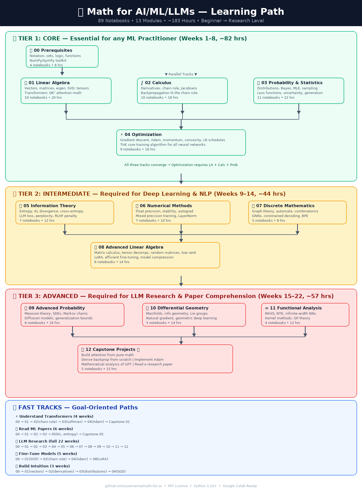

# 🗺️ Learning Path

This document lays out how the 13 modules relate to each other: what depends on what, the
three difficulty tiers, and a handful of goal-oriented fast tracks if you don't need the full
curriculum.



## Full Path by Tier

```
                        ┌─────────────────────────────────────────────────────────────┐
                        │              MATH FOR AI/ML/LLMs — LEARNING PATH             │
                        └─────────────────────────────────────────────────────────────┘

    ╔══════════════════════════════════════════════════════════════════════════════════════╗
    ║  TIER 🟢 CORE (Weeks 1-8)                                                             ║
    ╚══════════════════════════════════════════════════════════════════════════════════════╝

    [00 Prerequisites]
          │
          ▼
    ┌─────────────────────────────────────────────────────────────────────┐
    │                    PARALLEL CORE TRACKS                             │
    │                                                                     │
    │  [01 Linear Algebra] ──────────┐                                    │
    │         │                      │                                    │
    │         ▼                      ▼                                    │
    │  [02 Calculus] ─────────► [04 Optimization]                         │
    │         │                      │                                    │
    │         ▼                      │                                    │
    │  [03 Probability] ─────────────┘                                    │
    │                                                                     │
    └─────────────────────────────────────────────────────────────────────┘
                        │
                        ▼
    ╔══════════════════════════════════════════════════════════════════════════════════════╗
    ║  TIER 🟡 INTERMEDIATE (Weeks 9-14)                                                    ║
    ╚══════════════════════════════════════════════════════════════════════════════════════╝

    ┌─────────────────────────────────────────────────────────────────────┐
    │                                                                     │
    │  [05 Info Theory]     [06 Numerical]    [07 Discrete Math]         │
    │         │                   │                   │                   │
    │         └───────────────────┼───────────────────┘                   │
    │                             ▼                                       │
    │                  [08 Advanced Linear Algebra]                       │
    │                                                                     │
    └─────────────────────────────────────────────────────────────────────┘
                        │
                        ▼
    ╔══════════════════════════════════════════════════════════════════════════════════════╗
    ║  TIER 🔴 ADVANCED (Weeks 15-22)                                                       ║
    ╚══════════════════════════════════════════════════════════════════════════════════════╝

    ┌─────────────────────────────────────────────────────────────────────┐
    │                                                                     │
    │  [09 Advanced Probability] ──► [10 Diff. Geometry]                  │
    │              │                         │                            │
    │              │                         ▼                            │
    │              └──────────────► [11 Functional Analysis]              │
    │                                        │                            │
    │                                        ▼                            │
    │                           [12 Capstone Projects]                    │
    │                                                                     │
    └─────────────────────────────────────────────────────────────────────┘
```

## Alternative Fast Tracks

| Goal | Path | Est. Time |
|---|---|---|
| 🚀 **I want to understand transformers** | `00` → `01` → `02` (chain rule) → `03` (softmax) → `04` (Adam) → Capstone `12.01` | 4 weeks |
| 🚀 **I want to read ML papers** | `00` → `01` → `02` → `03` → `05` (KL, entropy) → Capstone `12.05` | 6 weeks |
| 🚀 **I want to fine-tune models** | `00` → `01` (SVD) → `02` (chain rule) → `04` (Adam) → `08` (LoRA) | 5 weeks |
| 🚀 **I want to do LLM research** | Complete path: `00`→`01`→`02`→`03`→`04`→`05`→`06`→`07`→`08`→`09`→`10`→`11`→`12` | 22 weeks |

## Module Dependency Notes

- **Module 00 (Prerequisites)** has no dependencies — start here if you're newer to
  mathematical notation.
- **Modules 01–03** (Linear Algebra, Calculus, Probability) only depend on Module 00 and can be
  studied in parallel, though the notebooks within each module are ordered and build on each
  other.
- **Module 04 (Optimization)** draws on both Calculus and Probability.
- **Modules 05–08** (the Intermediate tier) each build primarily on Module 03 (Probability) or
  Module 01/02 respectively, and converge into Module 08 (Advanced Linear Algebra), which
  assumes familiarity with the Core tier plus Modules 05–07.
- **Modules 09–12** (the Advanced tier) assume the full Core tier and lean on specific
  Intermediate modules — check each notebook's own prerequisite line for the exact notebooks
  it builds on.

For the notebook-by-notebook breakdown of key concepts and AI/ML connections in every module,
browse the module directories directly — each notebook's header states its prerequisites,
difficulty, and estimated time.
